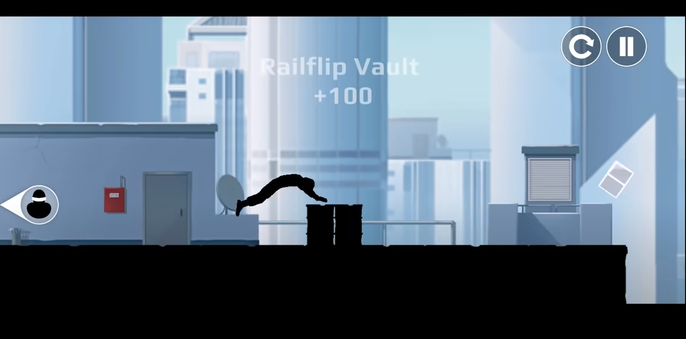

#  Game Ideas
## 1. Traffic Theft
### Game Overview
Traffic Theft is a fast-paced minigame from Pummel Party where players have 3 minutes to collect cash and gold bars from a building, cross a dangerous street with constant traffic, and deposit their loot in a scoring machine on the opposite side. Each cash pile is worth 1 point, and each gold bar is worth 2 points. The game's challenge comes from the movement penalty - the more items you carry, the slower you move, making it harder to dodge traffic. This balance of risk and reward, combined with ever-changing traffic conditions, makes it an engaging game that's easy to learn but rich in strategy.  

### Our Version
Game modifications include: adopting side-scrolling layout for clearer distinction between road and warehouse areas; replacing dynamic camera with fixed top-down view; introducing additional obstacles, weather effects (slippery roads in rain/limited visibility in fog), and police patrol mechanics.  

See the paper prototype below:  
<video width=400 controls>
  <source src="Videos/modified_traffic_theft_paper_prototype.mp4" type=video/mp4>
</video>

## 2. Vector
### Game Overview
Vector is a side-scrolling parkour action game where players take on the role of an employee trying to escape from an evil corporation. Using a simple but intuitive three-directional control system (up for jump/skill, down for slide, and right for sprint), players navigate through a dynamic urban environment, performing fluid parkour movements across city rooftops while evading security forces. The game combines straightforward controls with complex parkour combinations, branching paths, and progressive difficulty to create an engaging experience that balances speed, skill, and strategic decision-making.  

### Our Version  
<!-- 待写描述 -->

See the paper prototype below:  
<!-- 待传视频 （小于10MB）
<video width=400 controls>
  <source src= type=video/mp4>
</video>
-->