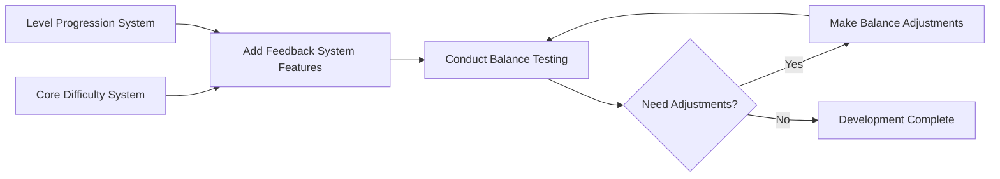

# 2025-group-15

2025 COMSM0166 group 15

## Your Game

Link to your game [PLAY HERE](https://uob-comsm0166.github.io/2025-group-15/road-crossing/Road-Crossing-Game.html)

Your game lives in the [/docs](/docs) folder, and is published using Github pages to the link above.

Include a demo video of your game here (you don't have to wait until the end, you can insert a work in progress video)

## Your Group

| Name         | E-mail                  | Username       |
|--------------|-------------------------|----------------|
| Lu Li        | <tu24288@bristol.ac.uk>   | cactus562      |
| Wei Liu      | <ir24727@bristol.ac.uk>   | ir24727        |
| Shuxiao Shi  | <ux24132@bristol.ac.uk>   | Wentaa         |
| Qinyuan Lu   | <he24343@bristol.ac.uk>   | mdfcsC         |
| Ruirui Jia   | <bl24729@bristol.ac.uk>   | alpenglow1     |
| Jinlong Xiao | <qo242236@bristol.ac.uk>  | yusheng2077    |

## Your Board

See our [Kanban board](https://github.com/orgs/UoB-COMSM0166/projects/117).

## Project Report

### Introduction

- 5% ~250 words
- Describe your game, what is based on, what makes it novel?

### Requirements

- 15% ~750 words
- Use case diagrams, user stories. Early stages design. Ideation process. How did you decide as a team what to develop?

#### Stakeholder Analysis

We applied the Onion Model to identify and analyze stakeholders involved in our game development:

| Layer | Stakeholder | Description |
|-------|------------|-------------|
| Core Layer | Development Team | Responsible for game design, programming, art creation, and initial testing |
| Inner Layer | Project Supervisors | Guide development process and evaluate project quality, providing critical feedback |
| Middle Layer | Beta Testers | Early players who test gameplay mechanics and provide feedback on user experience |
| Outer Layer | Target Players | Final users who will play the completed game |
| Outer Layer | Platform Provider | Distribution platform (e.g., Steam, App Store) hosting the game |

#### User Stories & Acceptance Criteria
<!-- 【DDL周六晚24点前】格式如下，表格 -->
| User Story | Acceptance Criteria |
|------------|---------------------|
| **As a developer**, I want to break down the game development process into modular components, so that each team member can work independently on different parts of the game. | **Given** a structured game development plan, **when** a team member starts working on a specific module, **then** they should be able to develop, test, and integrate their module without being blocked by dependencies. |
| **As a developer**, I want to design background music and various sound effects, so that players can experience greater immersion in the game. | **Given** a specific game scene or event, **when** background music and sound effects are played, **then** they should match the atmosphere and enhance the player's engagement. |
| **As a developer**, I want to implement high-quality artwork and animations, so that players can have a visually engaging and enjoyable experience. | **Given** a game character, object, or environment, **when** an animation or visual transition occurs, **then** it should be smooth, cohesive, and consistent with the game's artistic style. |
| **As a player**, I want to continue my game from the latest progress I‘ve arrived so that I can play whenever it suits me without losing progress. |**Given** I have made progress in the game, **when** I exit the game, **then** my progress should be saved automatically. |
| **As a player**, I want the game difficulty to gradually increase from easy to hard so that I can improve my skills step by step while maintaining the challenge and fun of the game. | **Given** that I am playing the game, **when** I complete a level, **then**  the next level should have a higher difficulty compared to the previous one. |
| **As a player**, I want the game to have help information pages so that I can refer to them whenever I need. | **Given** that I am in the game, **when** I press the help button, **then** I should be able to access the help information pages at any time during the game and the content should be clear and provide relevant instructions on how to play the game. |
| **As a player**, I want to adjust the background music volume or completely mute it, so that I can focus on the game without being distracted by the music. |**Given** the player is in the game settings menu, **when** the player adjusts the volume slider or clicks the "Mute Music" button, **then** the background music volume should change accordingly or be completely muted until the player enables it again. |
| **As a player**, I want to understand the game's storyline before starting, so that I can fully immerse myself in the game world and enhance my experience. | **Given** the player enters the game for the first time or selects the "Story Introduction" option, **when** the storyline screen appears, **then** the player should be able to read the background story and have the option to skip it and proceed directly to the game. |
| **As a player**, I want to customize my character’s appearance, such as clothing, hairstyle, or colors, so that I can create a character that reflects my personal style. | **Given** the player is in the character customization menu, **when** the player selects different hairstyles, clothing colors, or accessories, **then** the character’s appearance should update in real time and retain the selected customization during gameplay. |
| **As a player**, I want to experience a game where the difficulty level increases over time, so that the game becomes more interesting and soul-stirring as I become accustomed to the current difficulty. | **Given** the game has started, **when** player accumulates points above target threshold, **then** increase traffic density and speed according to difficulty curve.  **Given** current difficulty level, **when** player performance drops significantly, **then** maintain current difficulty until performance improves.  **Given** maximum difficulty reached, **when** player continues performing well, **then** maintain challenge without becoming impossible. |
| **As a player**, I need the ability to pause gameplay at any moment, allowing me to handle real-life interruptions and resume from where I left off. | **Given** active gameplay, **when** pause button pressed, **then** freeze all game elements and display pause menu.  **Given** game is paused, **when** resume selected, **then** restore exact game state and continue timer.  **Given** game is paused, **when** quit selected, **then** save current score and return to main menu. |
| **As a player**, I desire a score tracking and comparison system where I can measure my performance against others, fueling my competitive drive. | **Given** game completion, **when** score submitted, **then** save to leaderboard with player name and timestamp.  **Given** leaderboard view, **when** filtering options selected, **then** display relevant scores (daily/weekly/all-time).  **Given** new high score achieved, **when** game ends, **then** highlight achievement and offer sharing options. |

##### Example: Breakdown of Game Difficulty System Design

1. Core Difficulty System

- Character Parameters: movement speed, health points, etc.
- Environmental Interaction: obstacle movement speed, special terrain effects, etc.
- Mission Objectives: target score per round, time limits, cargo value multipliers, etc.
- Randomization Control: spawn point range for cargo, probability of special events, etc.

2. Level Progression System

- Level Structure: level mapping, unique mechanics for each level
- Completion Requirements: basic completion criteria and bonus challenges (perfect completion conditions)
- Progression Unlock System: establishing level prerequisites, defining specific unlock conditions
- Achievement System: designing an achievement framework to encourage continuous player improvement

3. Game Feedback System

- Difficulty Indicators: clear UI elements showing current difficulty level
- Level Information Display: providing level previews, objectives, and completion requirements
- Progress Tracking: implementing detailed game progress and achievement interface
- Real-time Feedback: offering timely prompts and guidance during gameplay

4. Game Balance Testing

- Internal Testing: conducting in-depth team testing, collecting detailed gameplay data
- User Group Testing: recruiting players of different age groups and gaming experience levels
- Data Analysis: establishing data collection and analysis mechanisms to evaluate difficulty curves
- Balance Adjustments: continuously optimizing parameters based on test feedback

5. Development Sequence

- We could establish a parameter configuration system early in development to facilitate later debugging and balance adjustments.

#### Brief Reflection

Through our game development process, our team has gained valuable experience in requirements analysis and project management. In terms of Epics, we learned how to break down large game development tasks into manageable modules, enabling team members to work in parallel. This modular approach improved our development efficiency.

For user stories, we adopted the format 'As a player, I want to adjust the background music volume or completely mute it so that I can focus on the game without being distracted by the music' to capture different stakeholders' needs. In game development, we considered both player requirements (such as game progress saving, difficulty progression, and volume control) and development team's needs (like modular development, sound design, and animation implementation). This comprehensive approach helped us maintain focus on user experience and technical feasibility.

For acceptance criteria, we used the Given-When-Then format to define completion standards. This helped us maintain clear objectives and provided guidelines for testing. In designing the difficulty system, we detailed acceptance criteria for each feature, ensuring testability and verifiability.

In understanding our application's context, we employed the Onion Model for stakeholder analysis, giving us a comprehensive view from core development team to end users. This helped us maintain awareness of various stakeholder needs throughout development.

The iterative process of defining requirements taught us the importance of clear communication and documentation. Well-defined requirements not only guide development but also serve as a foundation for testing and evaluation. This experience has helped us complete the current project and laid a foundation for future development.

### Design

- 15% ~750 words
- System architecture. Class diagrams, behavioural diagrams.
#### Class Diagram

Main Classes and Their Functions:

1. Game: The core class of the game, managing the game state, current level, selected character, game progress, and various systems (such as CarSystem, ItemSystem, ObstacleSystem). It provides methods to handle game logic and draw the game.

2. CarSystem: Manages the cars in the game. It generates, updates, and draws the cars, and also handles collision detection with the cars.

3. ItemSystem: Manages the items in the game, generating, updating, and drawing the items, and handling item pickup and drop.

4. ObstacleSystem: Manages the obstacles in the game, responsible for generating obstacles, updating them, checking for collisions, and drawing them.

5. UiManager: Handles the user interface, including the main menu, character selection, pause menu, etc. It manages interactions with buttons and menus.

6. Player: The player class, representing the player's state in the game, including position, speed, score, and the items they carry. It is responsible for updating the player state and interacting with items.

7. Car: Represents a car in the game, with basic properties such as position, speed, direction, etc. It provides methods for updating and drawing the car.

8. Item: Represents an item in the game, with properties like position, value, and size. It is responsible for drawing the item and displaying interaction states.

9. Obstacle: Represents an obstacle in the game, with properties like position, size, etc., and provides a method to draw the obstacle.

10. CollisionDetector: Responsible for detecting collisions in the game, including player-to-obstacle, player-to-item, and player-to-car collisions.

11. Button: Represents a button in the UI, with properties like position, size, and label. It provides methods for drawing and checking if the button has been clicked.

12. AssetManager: Manages the game's resources, such as images and sounds.

13. GameStorage: Manages game progress saving and loading.

14. Settings: Manages game settings, such as whether audio is enabled and the volume level.

15. GameStates: A class representing different game states, such as Menu, Character Select, Playing, Paused, Level Complete, Game Over, Level Select, Help, and Audio.

16. Lanes: Represents the lanes in the game, defining different lane speeds (such as Slow, Medium, Fast).

17. PauseButtons: Buttons in the pause menu, providing functions like resume, restart, return to the main menu, and toggle audio.

18. GameMode: Defines the game's modes, such as Normal and Testing mode.

19. LevelConfig: Game level configuration, defining settings for different levels (such as levels 1, 2, 3).

Relationships Between Classes:

- Game is the central class and connects to several subsystems: CarSystem, ItemSystem, ObstacleSystem, UiManager, and GameStorage. It controls game states (GameStates), modes (GameMode), and levels (LevelConfig).
  
- CarSystem, ItemSystem, and ObstacleSystem are associated with their respective entities (Car, Item, Obstacle) and all depend on CollisionDetector for collision detection.

- UiManager manages the game's user interface elements (such as Button), and interacts with the game state, mode (GameStates, GameMode), and player (Player).

- GameStorage is tightly coupled with GameMode to provide game saving and loading functionality.

- AssetManager manages game resources and connects to the main game (main) and GameMode.

#### Sequence Diagram

This sequence diagram represents the game flow and interactions between different components of the game. It covers the major events from game startup, level selection, gameplay mechanics, game over conditions, and additional features like help, pause, and cheating mode.

Key Components & Flow:

1. Game Startup

	•	The player opens the game, which initializes the menu (MenuPage).  
	•	UiManager sets up the UI and displays buttons such as "Start Game", "Select Level", "Help", and "Cheating Mode".

2. Starting a Game

	•	When the player clicks "Start Game", they are navigated to the CharacterSelectPage to choose a character.  
	•	After selection, the game starts by creating a new game instance in GamePage and initializing the level.

3. In-Game Interactions

	•	The game listens for player input (move(direction)).  
	•	Collision detection is performed against obstacles and cars:  
	 - If a collision occurs, the game triggers a "Game Over" state and returns to the menu.  
	 - If no collision occurs, the game updates the score and checks for level completion.  
	 - If the player completes the level, they advance to the next level.  

4. Level Selection

	•	Players can also choose "Select Level" from the main menu.  
	•	This leads to LevelSelectPage, where the player picks a level before selecting a character.  
	•	The game then starts at the selected level.  

5. Game Help

	•	If the player selects "Help", they are taken to the HelpPage to read instructions.  
	•	After viewing, they return to the main menu.  

6. Pause Menu

	•	Pressing the "Esc" key opens the PauseMenu, allowing the player to resume the game.

7. Cheating Mode

	•	If the player activates "Cheating Mode", UiManager enables cheats in GamePage, displaying a message confirming activation.

### Implementation

- 15% ~750 words

- Describe implementation of your game, in particular highlighting the three areas of challenge in developing your game.

### Evaluation

- 15% ~750 words

- One qualitative evaluation (your choice)

- One quantitative evaluation (of your choice)

- Description of how code was tested.

#### Qualitative Evaluations

After developing the core mechanics of the game, we conducted user evaluations by inviting members from other teams to test our game. Through Think Aloud sessions, we gathered feedback on gameplay, difficulty, and overall user experience. This helped us identify key areas for improvement and make necessary adjustments to enhance the game’s design and playability.

##### Key Areas of Improvement

1. **Lack of Instructions:** Our initial game menu included a "Help" option, but it was not prominent enough. As a result, testers were unaware of the key controls (e.g., pressing the spacebar to pick up cargo) when starting the game. To optimize this, we will implement a brief tutorial pop-up before entering the first level to help players quickly understand the controls.  

2. **Visual Clarity:** Since the background of our game is not yet fully designed, the vehicles and cargo lack sufficient contrast, which may impact the overall visual experience. Once the background is added, we will adjust the colors of characters, vehicles, and cargo to make them stand out more clearly.  

3. **Lane Speed Balance:** Testers noted that vehicles on the leftmost lane are moving too slowly, while the rightmost lane had vehicles moving too fast. This was an intentional design choice to increase gameplay variety and challenge, so we have decided to keep it as is. However, in our test version, all three lanes in Level 1 had vehicles moving in the same direction, making the level too easy. To improve it, we will modify the traffic flow so that vehicles move in two different directions.  

4. **Control Customization:** The default movement controls are set to the arrow keys (↑, ↓, ←, →). However, some testers prefer using their left hand for movement. To accommodate different operating modes, we will introduce an option for players to choose between the arrow keys and the WASD keys for movement.  

5. **Obstacle Mechanics in Level 3:** In Level 3, we introduced road obstacles that players must avoid to reach the other side. Testers suggested adding power-ups to remove obstacles in later levels. After discussion, we decided that introducing power-ups might make the game overly complex, so we will not include them in the current three levels.  

6. **Vehicle Type Diversity:** Currently, there is only one type of vehicle, which limits player choices and the richness of the gaming experience. It is recommended to add multiple vehicle types (e.g., bicycles, buses, trucks), each with unique attributes (e.g., speed, size), to provide players with more strategic options and personalized experiences.

7. **Collision Range Optimization:** The current collision range is inaccurate, causing confusion or frustration during player operations. It is recommended to optimize the collision detection mechanism, adjust the size and shape of collision boxes for greater precision, and add visual or audio feedback to help players better perceive collision boundaries and effects.

8. **Cargo Refresh Mechanism:** The current game design requires all 5 cargos in a round to be moved before new cargos are refreshed, leading players to mistakenly believe that completing a round means finishing the level. We will modify the cargo refresh mechanism so that new cargos will spawn 10 seconds after moving the first cargo.

9. **Weight and Speed Relationship:** Currently, cargo weight does not affect movement speed, leading players to prioritize high-value cargos and resulting in a lack of strategic diversity. It is recommended to introduce a weight-speed correlation mechanism, where heavier cargos slow down movement speed, and add weight indicators (e.g., color coding) to increase strategic depth and gameplay variety.

#### Quantitative Evaluations

We also analysed and evaluated the testers' feedback based on Nielsen's heuristic principles and documented our findings in the Heuristic Evaluation Table below.

| Interface | Issue | Heuristic(s) | Frequency 0(rare) to 4(common) | Impact 0(easy) to difficult(4) | Persistence 0(once) to 4(repeat) | Severity = (F+I+P)/3 |
| --- | --- | --- | --- | --- | --- | --- |
| Collision Detection | Ambiguous collision boundaries result in unpredictable gameplay outcomes | Visibility of System Status, Error Prevention | 4 | 4 | 4 | 4 |
| Game Background | Poor color contrast between interactive elements (vehicles/cargo) and background | Aesthetic and Minimalist Design, Match Between System and Real World | 4 | 3 | 4 | 3.7 |
| Main Menu | No in-game access to control instructions for help | Recognition Rather Than Recall, Help and Documentation | 3 | 3 | 2 | 2.7 |
| Speed Design | Unintuitive lane speed design (left=too slow, right=too fast) and abrupt character movement | Match Between System and Real World | 3 | 2 | 2 | 2.3 |
| Control Settings | Lack of alternative control scheme (e.g., WASD) causes right-hand fatigue | User Control and Freedom, Flexibility and Efficiency of Use | 2 | 1 | 3 | 2 |
| Cargo Refresh Mechanism | Missing progress indicators lead to confusion about total cargo required | Consistency and Standards | 2 | 2 | 1 | 1.6 |

- The scoring is based on the following criteria:

  - Frequency: Scores reflect the likelihood of problem recurrence. For example, the lack of a help button received a score of 3/4 because, while new players consistently miss key controls (e.g., pressing Spacebar to pick up cargo), experienced players may intuit the mechanic given the game’s relatively simple controls.

  - Impact: Measures disruption to core tasks. For instance, ambiguous collision boundaries severely hinder gameplay by causing repeated player deaths (4/4).

  - Persistence: Determines whether issues persist throughout the experience. Low visual contrast continuously disrupts player judgment, so it is scored 4/4.

- Priority resolution:
  - Critical Issue (Severity = 4.0): Resolve collision detection ambiguity immediately by visualizing collision boundaries or adding real-time feedback.

  - High Priority (Severity ≥ 3.0): Address the background contrast deficiency (3.7) in the next iteration.

  - Controversial Design: For counterintuitive lane speed differences (Severity = 2.3), enhance user onboarding (e.g., add a warning: "Caution: High-speed right lane!") or recalibrate speeds to balance challenge and rationality.

### Process

Our team's collaborative journey throughout this project combined structured face-to-face interaction with efficient digital coordination. We prioritized in-person engagement through bi-weekly team discussions while maintaining digital tools to track progress between meetings. This balanced approach leveraged the benefits of direct communication while ensuring consistent documentation and task management.

Communication was our foundation from the start. We established clear response expectations across different channels—committing to 24-hour maximum response times for important matters while allowing focus time for deep work. For conflict resolution, we developed a structured approach of documenting perspectives, evaluating options against project objectives, and making decisions through consensus where possible, with a voting system for more complex issues.

#### Kanban Board

In our project, we use a Kanban Board as our project management methodology due to its key advantages:

1.**Visual Workflow Management:** Kanban provides clear visualization of work progress through columns (Backlog, In Progress, Review, Done), allowing team members to understand project status at a glance.
2.**Work-in-Progress Limits:** Our Kanban implementation includes WIP limits for each column, preventing bottlenecks and ensuring steady workflow throughout the project lifecycle.
3.**Flexible Prioritization:** Kanban allows us to reprioritize tasks without disrupting the entire workflow, making it adaptable to changing project requirements.
Additionally, our Kanban board integrates task assignments, deadlines, and priority indicators for each card, providing comprehensive information for team coordination. Overall, Kanban's visual approach and flexibility make it an ideal choice for our project management.
（Figure Kanban Board Implementation）

#### Bi-Weekly Team Discussions

We conduct face-to-face team meetings twice a week to facilitate collaboration and project coordination due to several benefits:

1.**Enhanced Communication:** In-person discussions allow for immediate feedback, nuanced conversation, and non-verbal cues that improve understanding among team members.
2.**Structured Problem-Solving:** Our bi-weekly sessions follow a consistent format with designated time for progress updates, blockers discussion, and collaborative solution development.
3.**Team Cohesion:** Regular face-to-face interaction strengthens team relationships and builds trust, leading to more effective collaboration throughout the project.
Additionally, these discussions are documented with meeting minutes shared in our common repository, ensuring that decisions and action items are tracked systematically. Overall, our twice-weekly in-person meetings serve as critical touchpoints for alignment and momentum in our project execution.

#### Reflection on Our Collaborative Experience

Our collaboration revealed several key insights:
Our diverse backgrounds provided rich problem-solving perspectives, while transparent communication built trust among team members. Our adaptive planning helped navigate unexpected challenges effectively.
Initially, time zone differences complicated synchronous communication for team members studying abroad. We addressed this by recording meetings and implementing asynchronous decision-making when appropriate. Cultural differences occasionally led to misunderstandings about expectations, which we resolved through explicit conversations about working styles.
As the project progressed, we improved in documenting decisions and their rationales, creating valuable context for future reference. We became more efficient at determining when to work individually versus collaboratively, optimizing our collective productivity.
This collaborative experience strengthened both our project outcomes and individual capabilities. The attention we paid to establishing clear processes, utilizing appropriate tools, and maintaining open communication created a foundation for effective teamwork. The skills developed extend beyond the project itself, providing valuable professional competencies for our future endeavors.

### Conclusion

- 10% ~500 words

- Reflect on project as a whole. Lessons learned. Reflect on challenges. Future work.

### Contribution Statement

- Provide a table of everyone's contribution, which may be used to weight individual grades. We expect that the contribution will be split evenly across team-members in most cases. Let us know as soon as possible if there are any issues with teamwork as soon as they are apparent.

### Additional Marks

You can delete this section in your own repo, it's just here for information. in addition to the marks above, we will be marking you on the following two points:

- **Quality** of report writing, presentation, use of figures and visual material (5%)
  - Please write in a clear concise manner suitable for an interested layperson. Write as if this repo was publicly available.

- **Documentation** of code (5%)

  - Is your repo clearly organised?
  - Is code well commented throughout?
