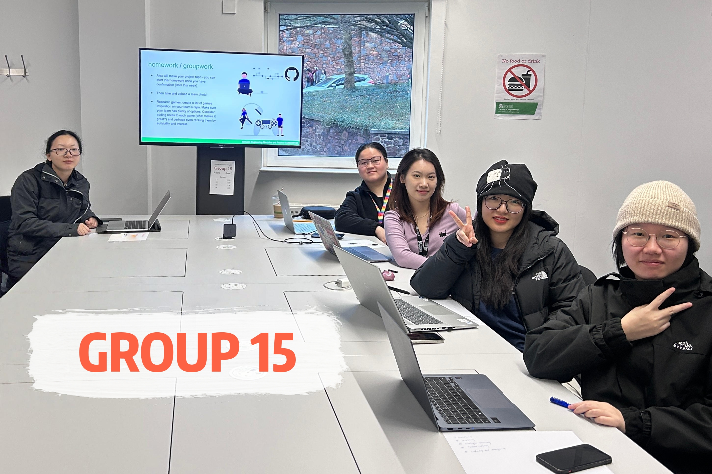
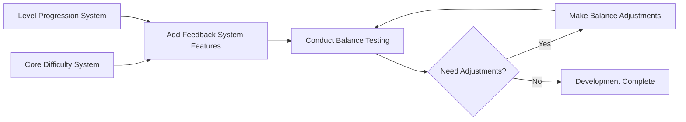

# 2025-group-15

2025 COMSM0166 group 15

## Contents of The Report

[Introduction](#introduction)  
[Requirement](#requirements)  
[Sustainability, ethics and accessibility](#sustainability-ethics-and-accessibility)  
[Design](#design)  
[Implementation](#implementation)  
[Evaluation](#evaluation)  
[Process](#process)  
[Conclution](#conclusion)  

## Crazy Delivery

Link to your game [PLAY HERE](https://uob-comsm0166.github.io/2025-group-15/road-crossing/Road-Crossing-Game.html)

Your game lives in the [/docs](/docs) folder, and is published using Github pages to the link above.

Include a demo video of your game here (you don't have to wait until the end, you can insert a work in progress video)

## Development Team

| Name         | E-mail                  | Username       |
|:------------:|:-----------------------:|:--------------:|
| Lu Li        | <tu24288@bristol.ac.uk> | cactus562      |
| Wei Liu      | <ir24727@bristol.ac.uk> | ir24727        |
| Shuxiao Shi  | <ux24132@bristol.ac.uk> | Wentaa         |
| Qinyuan Lu   | <he24343@bristol.ac.uk> | mdfcsC         |
| Ruirui Jia   | <bl24729@bristol.ac.uk> | alpenglow1     |

See our [Kanban board](https://github.com/orgs/UoB-COMSM0166/projects/117).

## Introduction

Our game, Road Crossing Delivery, builds on the classic mechanics of Frogger—players weave through busy traffic, timing their every move to survive. But unlike traditional arcade titles, you’re not just crossing a road—you’re on a mission to deliver.

As a delivery runner, your goal is to carry cargo safely across chaotic, fast-moving roads. Every package comes with weight, and that weight directly affects your speed. Carry something light for a quick escape, or haul heavier loads for bigger rewards—it’s a constant trade-off between risk and payoff.

To keep each run fresh, we implemented a dynamic traffic system that generates varied vehicle patterns and pacing. Each level is set in a different visual scene, accompanied by music that matches the atmosphere—adding an almost rhythmic tension to the crossing. What looks like a simple arcade game quickly turns into a challenge of split-second decisions, timing, and planning.

What makes our game novel is its weight-based movement mechanic, which creates a direct connection between risk and reward. The more you carry, the harder it gets—but the greater the payoff. This, combined with shifting environments, layered difficulty, and rhythmic pacing, transforms a familiar arcade formula into a delivery challenge that’s both strategic and reflex-driven.

## Requirements

### Stakeholder Analysis

To ensure comprehensive project development, we applied the **Onion Model** to analyze stakeholders involved in our game. The model helped us identify key groups at varying levels of influence:

| **Layer**          | **Stakeholders**                                                   |
|--------------------|---------------------------------------------------------------------|
| **Core**           | Development Team – design, code, test, and create assets           |
| **Inner**          | Project Supervisors – provide direction and feedback               |
| **Middle**         | Beta Testers – test features and report usability issues           |
| **Outer (Players)**| Target Players – ultimate end-users who shape game success         |
| **Outer (Platform)**| Platform Providers – ensure delivery and accessibility             |

### User Stories & Acceptance Criteria
To address both technical implementation and player experience, we divided the user stories and acceptance criteria into two categories: <Developer-Oriented> and <Player-Oriented>.

#### Developer-Oriented

> **User Stories**  
> As developers, we aim to ensure the game is **modular**, **immersive**, and **visually polished**. This includes:
> - Breaking the game into independent, well-defined components.
> - Designing immersive sound effects and background music that enhance the > gaming experience.
> - Implementing smooth animations that are consistent with the game's artistic style.

> **Acceptance Criteria**
> 1. Each game module must be independently developed, tested, and integrated following a clear development plan.
> 2. Sound effects and background music should be appropriate for each scene, enhancing immersion.
> 3. Animations must be fluid, seamless, and visually aligned with the game's design and artistic vision.

#### Player-Oriented

> **User Stories**  
> As players, we expect a **progressively challenging** experience with options for **customization**. Specifically, we want to:
> - Experience increasing difficulty levels throughout the game.
> - Be able to pause and resume gameplay at any point.
> - Customize characters and see these changes in real time.
> - Track our scores and compete on leaderboards.
> - Engage with eco-friendly elements within the game.

> **Acceptance Criteria**
> 1. The game's difficulty should gradually increase with each level to maintain player engagement.
> 2. The pause feature must freeze the game at the current state and allow players to resume from the exact point where they paused.
> 3. Customizations made to characters should appear instantly and in real-time during gameplay.
> 4. Players' scores should be recorded with timestamps, and high scores should trigger celebratory feedback.
> 5. The game should include eco-friendly vehicle options such as bikes, electric cars, or other sustainable alternatives.

#### Example: Breakdown of Game Difficulty System Design

1. **Core Difficulty System**  
   The game’s difficulty is influenced by several parameters, such as character attributes, environmental factors, mission objectives, and random events. Key factors include the player’s movement speed and health points, obstacles, mission goals like target scores or time limits, and dynamic in-game events. These combined elements contribute to the overall challenge level and enhance the player’s experience.

2. **Level Progression System**  
   The game is divided into unique levels, each with specific completion criteria and progression unlocks. Each level may also include bonus challenges for perfect completion. Achievements are designed to reward players based on progress and skill, incentivizing improvement.

3. **Game Feedback System**  
   The feedback system provides players with clear indicators of difficulty, progress tracking, and real-time feedback. This ensures that players are aware of their current status, enabling them to adjust their strategies and optimize gameplay performance.

4. **Balance Testing**  
   Extensive balance testing was conducted to ensure the game remains both challenging and enjoyable. This included internal evaluations and feedback from players of different ages and experience levels. Based on the results, adjustments were made to the difficulty curve to find the right balance between challenge and playability.

5. **Development Sequence**  
   Early in the development process, a parameter configuration system was established to facilitate debugging and balance adjustments. This system helped streamline the overall development workflow and ensured that balance adjustments could be made efficiently as new challenges and feedback emerged.

### Reflection
Our team gained valuable insights into requirements analysis and project management. By breaking large tasks into manageable modules, we improved efficiency. Defining user stories with clear acceptance criteria using the Given-When-Then format helped us set precise expectations and ensured testability. We used the Onion Model to maintain an understanding of stakeholders' perspectives, which helped us keep user experience and technical feasibility aligned. Overall, the iterative process of refining requirements taught us the importance of clear communication and documentation, which will guide future developments.

## Sustainability, ethics and accessibility

### 1. Sustainability Analysis

Based on the Sustainability Awareness Framework (SusAF), we analyzed our game's potential sustainability impacts across five key dimensions:

| **Sustainability Dimension** | **Guiding Question** | **Game-Related Impact** |
|------------------------------|----------------------|--------------------------|
| **Individual** | Does the game promote personal health, growth, or learning? | The game trains players’ reaction time, coordination, and planning skills. By increasing difficulty and simulating real-life traffic situations, it helps raise awareness about the dangers of crossing roads and encourages safe behavior. |
| **Environmental** | Does the game encourage environmentally friendly behavior or reduce energy/resource use? | The game is lightweight and browser-based, requiring minimal computational power and no installation. This allows it to run smoothly even on older or low-spec devices, reducing energy use and electronic waste. By avoiding server-side processing and cloud storage, the game minimizes carbon footprint during play. Its use of static 2D assets and low-bandwidth requirements also supports greener digital distribution.|
| **Technical** | Is the software efficient, maintainable, and low in energy/resource consumption? | The game adopts a modular architecture that supports maintainability and future extension. Its lightweight design ensures smooth performance even on low-end devices, which helps reduce energy consumption. |

### 2. Green Software Patterns

We have reviewed the Green Software Foundation’s Green Software Patterns and identified the following three that apply to our game:

1. **Avoid Polling** – Instead of using continuous polling techniques (such as `setInterval` or checking conditions on every frame), our game uses efficient, frame-based updates. For example, cars are only generated every 60 frames (`frameCount % 60 === 0`) instead of every frame, which reduces unnecessary CPU usage and improves energy efficiency.

2. **Green Defaults** – The game's audio settings default to moderate volume, and players have the option to toggle audio off entirely. This provides a lower energy footprint by default and empowers users to reduce energy usage during gameplay, especially on mobile or battery-powered devices.

3. **Avoid Tracking Unnecessary Data** – Our game does not collect any player analytics or behavior tracking data. We only store essential progress locally using `localStorage`, which ensures user privacy and minimizes storage and energy costs associated with data processing.

## Design

The system design of the game adopts a modular and object-oriented architecture to ensure maintainability, scalability, and ease of debugging. Each core component is encapsulated within a dedicated class, responsible for managing a distinct aspect of gameplay. The central controller, the `Game` class, maintains the overall game state, including the selected level, player character, and current progress. It coordinates the initialization and update cycles of key subsystems, ensuring seamless interaction among components.

### System Architecture

The `Game` class acts as the backbone of the game logic, integrating with several subsystems: `CarSystem`, `ItemSystem`, `ObstacleSystem`, and `UiManager`. It also handles transitions between various game states, defined in the `GameStates` class (e.g., Menu, Playing, Paused, Game Over), and supports different modes such as Normal and Testing via the `GameMode` class.

The vehicle logic is managed by the `CarSystem`, which is responsible for generating, updating, and rendering cars in different lanes. It incorporates the `Car` class to define vehicle properties such as speed, position, and direction. Similarly, `ItemSystem` and `ObstacleSystem` manage items and obstacles respectively, both relying on shared collision detection logic provided by the `CollisionDetector` class.

The `Player` class represents the player-controlled character, encapsulating attributes like position, speed, score, and collected items. It interacts with the environment and responds to user input, including movement and item pickup/drop actions.

The user interface is managed by the `UiManager`, which controls various screens such as the main menu, character selection, help, and pause menu. It works closely with the `Button` and `PauseButtons` classes to render interactive UI elements and handle input events like starting a game or toggling sound.

To support dynamic content loading, the `AssetManager` class handles resource management, including images and sounds. Game settings such as audio volume and toggles are controlled by the `Settings` class. Game progress persistence is achieved through the `GameStorage` class, which manages saving and loading states depending on the active game mode.

Levels are configured using the `LevelConfig` class, which defines difficulty, goal conditions, and level-specific parameters. Lane behavior is represented by the `Lanes` class, which categorizes traffic flow into speeds such as Slow, Medium, and Fast.

This architecture supports code reusability and parallel development by dividing responsibilities among self-contained modules.

### Behavioural Design

The game follows a well-defined sequence of interactions, illustrated in the sequence diagram.

At startup, the game initializes the main menu, where players can start a game, select a level, read help instructions, or activate cheating mode. The `UiManager` handles UI display and routes input to the correct action.

Starting a new game takes the player to the character selection screen (`CharacterSelectPage`). Once a character is chosen, a new `Game` instance is created, and the appropriate level configuration is loaded.

During gameplay, the system updates in real time, handling player input and environmental changes. Movement commands are processed, and collisions are detected. If the player collides with an obstacle or vehicle, the game transitions to a "Game Over" state and returns to the main menu. If the player completes the level objectives, they are promoted to the next stage.

Players may pause the game using the escape key, which brings up the `PauseMenu`. Here, they can resume the game, restart the level, or return to the main menu. Audio can also be toggled on or off. Cheating mode, when enabled, activates debug features and displays a confirmation message on the screen.

Help instructions are accessible from the main menu. When selected, the player is navigated to the `HelpPage`, which provides gameplay guidance and interface descriptions. Players may return to the menu after viewing the instructions.

The modular structure and clearly defined sequences support smooth user interactions and maintain high responsiveness across the game loop.

## Implementation

Our game is a 2D top-down arcade-style game in which the player is tasked with transporting cargo from the left side of the road to the right, while avoiding incoming traffic. The game was implemented using JavaScript, and we focused on delivering smooth movement, realistic traffic behavior, and increasing difficulty over time.

Throughout the development process, we encountered several technical and gameplay design challenges. We highlight three major areas of difficulty and how we addressed them.

### 1. **Collision Detection Between Player and Vehicles**

**Challenge:**  
Players may collide with vehicles while crossing the road, so precise collision detection is essential for a smooth gameplay experience. In early versions, collisions were often **missed ("false negatives") or triggered too early ("false positives")**, resulting in unstable and frustrating gameplay.

**Solution:**  
Initially, both the player and vehicles were treated as rectangles, and we used basic **rectangle overlap detection** to determine collisions. However, this led to unfair situations where even slight contact with a vehicle's edge could eliminate the player. To improve realism and player satisfaction, we refined our detection logic to consider the **direction of the vehicle**:

- For vehicles coming **from the top**, a collision is only registered when the vehicle overlaps with the **lower half of the player**, simulating a front-on impact.
- For vehicles coming **from the bottom**, a collision occurs as soon as the vehicle touches the **bottom edge** of the player, representing a rear collision.

This **direction-sensitive collision model** not only reduced unfair eliminations but also better matched visual expectations, making the game feel more responsive and fair.

### 2. **Traffic Flow Design and Generation**

**Challenge:**  
Designing realistic and challenging traffic patterns was essential. If traffic appeared too randomly, the game could feel either too easy or unfairly difficult. On the other hand, overly predictable patterns made the game repetitive.

**Solution:**
To maintain a dynamic and unpredictable gameplay experience, our game adopts a **randomized car generation system**. The roads are categorized into three types based on speed: slow, medium, and fast. Each lane manages its own spawning logic independently.

At runtime, the system uses a **frame-based timer** to determine whether a new car should be generated. The time interval between car spawns is randomly selected within a defined range (between 60 and 180 frames, roughly 1 to 3 seconds). After each generation, the interval is reset to a new random value, which prevents predictable traffic patterns.

To avoid long gaps in traffic, we enforce a **maximum waiting threshold of 240 frames** (around 4 seconds). If a lane remains inactive beyond this time, a car will be spawned regardless of the randomized logic. Additionally, each lane is initialized with a random timer offset to further avoid synchronization across lanes.

At the beginning of the game, a limited number of vehicles are also randomly generated on each lane based on probability, to simulate a pre-existing traffic environment.

### 3. **Cargo Generation, Value System, and Refresh Mechanism**

**Challenge:**  
Our initial idea was to use the number of successfully transported cargo items as the win condition. However, through player testing, we found that this made the game somewhat repetitive and lacked strategic depth.

**Solution:**  
To improve player engagement and add more decision-making, we introduced a **cargo value system**. Instead of identical cargo items, each item is assigned a random **weight and value**, clearly labeled for the player. The win condition is now based on reaching a **target total value**, not just quantity. This encourages players to make trade-offs—for example, whether to take a heavier, high-value item that slows them down or several lighter, low-value ones.

To reflect the weight difference in gameplay, we also linked the **player's movement speed** to the total weight of the carried cargo. Heavier loads slow down the player significantly, increasing the challenge and adding realism to the gameplay.

We also iterated on the **cargo refresh mechanism**. In early versions, all cargo items were refreshed at once only after the previous batch was completely delivered. Based on tester feedback, we changed this to **immediate single-item respawning**, where a new cargo spawns each time one is delivered. This ensures that the player always has a variety of cargo options to choose from, enhancing the strategic aspect and making the gameplay more dynamic. After implementing this change, we noticed a significant improvement in overall user experience and gameplay flow.

## Evaluation

### Qualitative Evaluations

After developing the core mechanics of the game, we conducted user evaluations by inviting members from other teams to test our game. Through Think Aloud sessions, we gathered feedback on gameplay, difficulty, and overall user experience. This helped us identify key areas for improvement and make necessary adjustments to enhance the game’s design and playability.

#### Key Areas of Improvement

1. **Lack of Instructions:** Our initial game menu included a "Help" option, but it was not prominent enough. As a result, testers were unaware of the key controls (e.g., pressing the spacebar to pick up cargo) when starting the game. To optimize this, we will implement a brief tutorial pop-up before entering the first level to help players quickly understand the controls.  

2. **Visual Clarity:** Since the background of our game is not yet fully designed, the vehicles and cargo lack sufficient contrast, which may impact the overall visual experience. Once the background is added, we will adjust the colors of characters, vehicles, and cargo to make them stand out more clearly.  

3. **Lane Speed Balance:** Testers noted that vehicles on the leftmost lane are moving too slowly, while the rightmost lane had vehicles moving too fast. This was an intentional design choice to increase gameplay variety and challenge, so we have decided to keep it as is. However, in our test version, all three lanes in Level 1 had vehicles moving in the same direction, making the level too easy. To improve it, we will modify the traffic flow so that vehicles move in two different directions.  

4. **Control Customization:** The default movement controls are set to the arrow keys (↑, ↓, ←, →). However, some testers prefer using their left hand for movement. To accommodate different operating modes, we will introduce an option for players to choose between the arrow keys and the WASD keys for movement.  

5. **Obstacle Mechanics in Level 3:** In Level 3, we introduced road obstacles that players must avoid to reach the other side. Testers suggested adding power-ups to remove obstacles in later levels. After discussion, we decided that introducing power-ups might make the game overly complex, so we will not include them in the current three levels.  

6. **Vehicle Type Diversity:** Currently, there is only one type of vehicle, which limits player choices and the richness of the gaming experience. It is recommended to add multiple vehicle types (e.g., bicycles, buses, trucks), each with unique attributes (e.g., speed, size), to provide players with more strategic options and personalized experiences.

7. **Collision Range Optimization:** The current collision range is inaccurate, causing confusion or frustration during player operations. It is recommended to optimize the collision detection mechanism, adjust the size and shape of collision boxes for greater precision, and add visual or audio feedback to help players better perceive collision boundaries and effects.

8. **Cargo Refresh Mechanism:** The current game design requires all 5 cargos in a round to be moved before new cargos are refreshed, leading players to mistakenly believe that completing a round means finishing the level. We will modify the cargo refresh mechanism so that new cargos will spawn 10 seconds after moving the first cargo.

9. **Weight and Speed Relationship:** Currently, cargo weight does not affect movement speed, leading players to prioritize high-value cargos and resulting in a lack of strategic diversity. It is recommended to introduce a weight-speed correlation mechanism, where heavier cargos slow down movement speed, and add weight indicators (e.g., color coding) to increase strategic depth and gameplay variety.

#### Heuristic Evaluation

We also analysed and evaluated the testers' feedback based on Nielsen's heuristic principles and documented our findings in the Heuristic Evaluation Table below.

| Interface | Issue | Heuristic(s) | Frequency 0(rare) to 4(common) | Impact 0(easy) to difficult(4) | Persistence 0(once) to 4(repeat) | Severity = (F+I+P)/3 |
| --- | --- | --- | --- | --- | --- | --- |
| Collision Detection | Ambiguous collision boundaries result in unpredictable gameplay outcomes | Visibility of System Status, Error Prevention | 4 | 4 | 4 | 4 |
| Game Background | Poor color contrast between interactive elements (vehicles/cargo) and background | Aesthetic and Minimalist Design, Match Between System and Real World | 4 | 3 | 4 | 3.7 |
| Main Menu | No in-game access to control instructions for help | Recognition Rather Than Recall, Help and Documentation | 3 | 3 | 2 | 2.7 |
| Speed Design | Unintuitive lane speed design (left=too slow, right=too fast) and abrupt character movement | Match Between System and Real World | 3 | 2 | 2 | 2.3 |
| Control Settings | Lack of alternative control scheme (e.g., WASD) causes right-hand fatigue | User Control and Freedom, Flexibility and Efficiency of Use | 2 | 1 | 3 | 2 |
| Cargo Refresh Mechanism | Missing progress indicators lead to confusion about total cargo required | Consistency and Standards | 2 | 2 | 1 | 1.6 |

- The scoring is based on the following criteria:

  - Frequency: Scores reflect the likelihood of problem recurrence. For example, the lack of a help button received a score of 3/4 because, while new players consistently miss key controls (e.g., pressing Spacebar to pick up cargo), experienced players may intuit the mechanic given the game’s relatively simple controls.

  - Impact: Measures disruption to core tasks. For instance, ambiguous collision boundaries severely hinder gameplay by causing repeated player deaths (4/4).

  - Persistence: Determines whether issues persist throughout the experience. Low visual contrast continuously disrupts player judgment, so it is scored 4/4.

- Priority resolution:
  - Critical Issue (Severity = 4.0): Resolve collision detection ambiguity immediately by visualizing collision boundaries or adding real-time feedback.

  - High Priority (Severity ≥ 3.0): Address the background contrast deficiency (3.7) in the next iteration.

  - Controversial Design: For counterintuitive lane speed differences (Severity = 2.3), enhance user onboarding (e.g., add a warning: "Caution: High-speed right lane!") or recalibrate speeds to balance challenge and rationality.

### Quantitative Evaluations

We collected data from 10 participants who completed tasks under both easy and difficult conditions, to exam how task difficulty affects both user workload and system usability.

We use NASA TLX and SUS to measure separately, and use the [Wilcoxon signed-rank test](https://www.statology.org/wilcoxon-signed-rank-test-calculator/) to determine statistical significance of differences between conditions, with α=0.05 as the threshold for significance.

#### [The NASA Task Load Index](./Images/NASA_TLX-template.png)

The table below presents participants' ratings across six dimensions of workload, as well as calculated overall workload scores:

|User|Difficulty|Mental Demand|Physical Demand|Temporal Demand|Performance|Effort|Frustration|Score|
|---|---|---|---|---|---|---|---|---|
|User 1|Easy|13|6|12|13|10|6|45.00|
|User 1|Difficult|14|7|15|7|13|6|46.67|
|User 2|Easy|11|9|5|14|16|7|46.67|
|User 2|Difficult|11|9|8|14|17|7|50.00|
|User 3|Easy|19|18|11|4|13|10|57.50|
|User 3|Difficult|20|20|12|2|11|11|58.33|
|User 4|Easy|13|15|7|1|15|11|46.67|
|User 4|Difficult|13|16|7|1|16|13|50.00|
|User 5|Easy|12|7|12|11|10|10|46.67|
|User 5|Difficult|15|12|16|14|14|18|69.17|
|User 6|Easy|8|12|11|10|11|9|45.83|
|User 6|Difficult|10|18|14|12|14|12|61.67|
|User 7|Easy|5|10|12|11|6|2|33.33|
|User 7|Difficult|7|8|11|13|9|3|37.50|
|User 8|Easy|9|16|12|8|11|11|50.83|
|User 8|Difficult|13|20|10|6|9|15|55.83|
|User 9|Easy|3|5|8|1|5|2|15.00|
|User 9|Difficult|7|8|14|13|15|10|50.83|
|User 10|Easy|3|8|14|18|9|1|39.17|
|User 10|Difficult|5|9|15|17|9|3|43.33|

*W test statistic = 0*  
*Number of non-tied pairs (n) = 10*

> All values except the Score column represent ratings on the NASA TLX scale. The Score column represents the non-weighted average score calculated using (scaleValue - 1) * 5.

#### [System Usability Survey](./Images/SUS-template.png)

|User|Difficulty|Q1|Q2|Q3|Q4|Q5|Q6|Q7|Q8|Q9|Q10|Score|
|---|---|---|---|---|---|---|---|---|---|---|---|---|
|User 1|Easy|4|2|4|1|5|1|5|1|4|2|87.5|
|User 1|Difficult|4|2|5|1|5|1|5|1|5|1|95.0|
|User 2|Easy|4|3|5|2|2|1|4|2|4|1|75.0|
|User 2|Difficult|4|4|5|2|2|2|4|2|4|1|70.0|
|User 3|Easy|3|2|3|4|4|1|5|3|3|1|67.5|
|User 3|Difficult|3|2|3|4|4|1|5|3|3|1|67.5|
|User 4|Easy|3|1|4|2|4|2|4|2|5|1|80.0|
|User 4|Difficult|3|1|4|2|4|2|4|2|5|1|80.0|
|User 5|Easy|3|2|4|1|4|2|5|2|4|1|80.0|
|User 5|Difficult|3|2|3|1|4|2|5|2|4|1|77.5|
|User 6|Easy|3|2|4|4|3|3|4|3|4|1|62.5|
|User 6|Difficult|3|3|3|4|3|4|3|3|4|2|50.0|
|User 7|Easy|3|1|5|1|4|2|5|1|5|1|90.0|
|User 7|Difficult|3|1|5|1|4|2|5|1|5|1|90.0|
|User 8|Easy|3|2|4|3|4|4|3|3|5|1|65.0|
|User 8|Difficult|4|4|3|4|5|1|2|2|3|2|60.0|
|User 9|Easy|3|2|4|2|4|1|4|2|5|2|77.5|
|User 9|Difficult|3|2|2|3|2|2|2|3|3|2|50.0|
|User 10|Easy|2|1|5|1|3|2|4|3|5|1|77.5|
|User 10|Difficult|1|1|5|1|3|2|5|3|5|1|77.5|

*W test statistic = 4*  
*Number of non-tied pairs (n) = 6*

> Values for Q1-Q10 represent ratings on the 5-point SUS scale. The Score column is calculated according to SUS methodology: (score-1) for odd-numbered items, (5-score) for even-numbered items, sum multiplied by 2.5.

#### Findings

The results of our study indicate:

- The difficult condition successfully created a more challenging experience, with all participants reporting significantly increased workload, confirming the effectiveness of our difficulty manipulation.
- Despite the increased challenge, the fundamental usability of the system remained robust, with no statistically significant decline in SUS scores. This suggests the system maintains its intuitive operation and accessibility even under more demanding conditions.
- Individual differences in adaptability were observed, with some users (particularly User 9) showing dramatic changes in both workload and usability metrics, highlighting varying resilience to increased difficulty among users.

In conclusion, our system successfully establishes meaningful differentiation between difficulty levels while maintaining a solid foundation of user experience quality.  

## Process

Our team's collaborative strategy for this project was based on a hybrid model that combined structured face-to-face meetings with digital tools for asynchronous coordination. This approach allowed us to maintain high levels of engagement and accountability while accommodating individual work preferences and time constraints.

### Team Collaboration

We held in-person team meetings twice a week to discuss ongoing progress, solve blockers, and coordinate responsibilities. These meetings followed a consistent format: each member provided updates, raised questions, and participated in collaborative problem-solving. One team member was responsible for recording meeting minutes, which were stored in a shared repository on GitHub. This ensured that key decisions, deadlines, and action points were properly documented and accessible to all members, including those occasionally absent due to scheduling conflicts.

For day-to-day communication, we used WhatsApp for quick updates and clarifications, while email was used for more formal or non-urgent matters. We established clear communication expectations early on, including a 24-hour response guideline for critical topics, which helped keep discussions timely and project momentum consistent.

### Tools and Workflow

To manage our tasks and track overall project progress, we used a GitHub-based **Kanban board**, structured with columns: “Todo,” “In Progress,” “Lagging,” and “Done.” Each task card included a detailed description, deadlines, priority level, and assigned team member. This visual workflow made it easy for everyone to track the status of work at a glance and identify bottlenecks early.

We implemented **Work-in-Progress (WIP) limits** on active tasks to reduce overload and maintain a steady flow across development stages. The Kanban board’s flexibility also enabled us to reprioritize tasks efficiently in response to changing project needs, such as debugging or design revisions.

Code collaboration was facilitated through **Git and GitHub**, which we used for version control, pull request reviews, and issue tracking. For document collaboration—including this report—we used **Google Docs**, which allowed for simultaneous editing and real-time commenting during report drafting sessions.

### Roles and Responsibilities

Although our team structure was relatively flat to encourage mutual support, we assigned informal roles based on individual strengths and preferences:
**Team Coordinator**: Scheduled meetings, tracked deadlines, and maintained overall alignment.
**Lead Developer**: Took responsibility for core game logic and system architecture.
**UI/UX Designer**: Led the interface design and user experience considerations.
**Quality Assurance Lead**: Focused on bug testing, performance evaluation, and validation of game features.
**Documentation Specialist**: Maintained records, prepared reports, and ensured clarity in written materials.

Despite these roles, our team practiced flexibility. Members regularly contributed outside their primary area, whether helping with debugging, writing documentation, or preparing assets. This cross-functional support improved efficiency and strengthened our understanding of the entire project.

### Reflection and Lessons Learned

Throughout the project, our collaboration matured significantly. In the early stages, we encountered challenges such as scheduling conflicts, unclear task boundaries, and varied working styles. For example, one of the main challenges was that one member was unable to attend the face-to-face discussion because he was temporarily home. To address this, we began recording meetings and implementing asynchronous feedback loops via shared documents and chat summaries.

We also encountered occasional miscommunication, especially regarding expectations and deadlines. These were resolved through more explicit documentation, frequent check-ins, and open discussions about preferred working styles. Over time, we became more effective at anticipating potential issues and proactively redistributing work as needed.

One key improvement was in our decision-making process. Initially, discussions sometimes stalled due to differing opinions. Later, we introduced a lightweight decision model—first discussing pros and cons of each approach, then voting or assigning final say based on area of expertise. This balanced structure with inclusiveness and speed.

Overall, this project greatly enhanced our collaborative abilities. We learned the value of structured communication, flexible planning, and respectful team dynamics. The systems we developed—such as routine meeting minutes, Kanban tracking, and clear role definitions—not only improved this project’s outcome but also gave us transferrable teamwork skills for future academic and professional environments.

## Conclusion

The development of Road Crossing Delivery began with a simple yet compelling idea: reimagining a classic mechanic from Frogger, but giving it a purpose—delivery under pressure. Over the course of the project, we took this concept and built around it a game that’s easy to pick up but rich in moment-to-moment decision making.

One of our key innovations was the weight-based movement system—each cargo item slows the player differently, requiring real-time strategic trade-offs between speed and potential score. Combined with the randomly generated traffic flow, this made each playthrough feel dynamic and engaging. From a development perspective, building a custom vehicle generation system taught us to balance randomness with fairness, ensuring challenge without frustration.

Our game also evolves visually and rhythmically. With distinct environments and background music for each level, we aimed to create a sense of progression and variety. This introduced technical challenges in synchronizing audio and visual transitions, which we solved through modular scene management.

Teamwork was central to our progress. We split responsibilities across coding, UI design, asset preparation, and sound design—iterating frequently and sharing feedback in real-time. Through this collaborative process, we not only improved the game but also strengthened our communication and problem-solving skills.

While the project met most of our initial goals, some aspects—such as more diverse obstacles or level-based difficulty scaling—remained on our wish list due to time constraints. Nonetheless, we are proud of the final product. Informal playtests revealed players quickly grasped the mechanics and enjoyed the high-risk, high-reward decision-making under pressure.

Looking ahead, Road Crossing Delivery could be expanded with competitive multiplayer features or adaptive AI behaviors. More importantly, this project gave us hands-on experience applying iterative development, user-centered design, and technical debugging in a real-world setting. It was a game about crossing roads, but also about crossing the threshold from idea to execution—and learning to work as a team every step of the way.

---
### Contribution Statement

- Provide a table of everyone's contribution, which may be used to weight individual grades. We expect that the contribution will be split evenly across team-members in most cases. Let us know as soon as possible if there are any issues with teamwork as soon as they are apparent.

