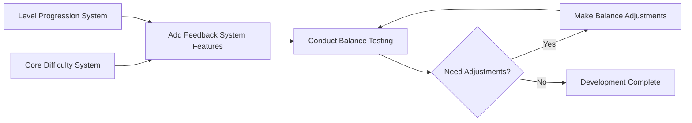

# 2025-group-15

2025 COMSM0166 group 15

## Your Game

Link to your game [PLAY HERE](https://peteinfo.github.io/COMSM0166-project-template/)

Your game lives in the [/docs](/docs) folder, and is published using Github pages to the link above.

Include a demo video of your game here (you don't have to wait until the end, you can insert a work in progress video)

## Your Group

| Name         | E-mail                  | Username       |
|--------------|-------------------------|----------------|
| Lu Li        | <tu24288@bristol.ac.uk>   | cactus562      |
| Wei Liu      | <ir24727@bristol.ac.uk>   | ir24727        |
| Shuxiao Shi  | <ux24132@bristol.ac.uk>   | Wentaa         |
| Qinyuan Lu   | <he24343@bristol.ac.uk>   | mdfcsC         |
| Ruirui Jia   | <bl24729@bristol.ac.uk>   | alpenglow1     |
| Jinlong Xiao | <qo242236@bristol.ac.uk>  | yusheng2077    |

## Your Board

See our [Kanban board](https://github.com/orgs/UoB-COMSM0166/projects/117).

## Project Report

### Introduction

- 5% ~250 words
- Describe your game, what is based on, what makes it novel?

### Requirements

- 15% ~750 words
- Use case diagrams, user stories. Early stages design. Ideation process. How did you decide as a team what to develop?

#### Stakeholders
<!-- 【DDL周六晚24点前】表格 -->

#### User Stories & Acceptance Criteria
<!-- 【DDL周六晚24点前】格式如下，表格 -->
| User Story | Acceptance Criteria |
|------------|---------------------|
| **As a developer**, I want to break down the game development process into modular components, so that each team member can work independently on different parts of the game. | **Given** a structured game development plan, **when** a team member starts working on a specific module, **then** they should be able to develop, test, and integrate their module without being blocked by dependencies. |
| **As a developer**, I want to design background music and various sound effects, so that players can experience greater immersion in the game. | **Given** a specific game scene or event, **when** background music and sound effects are played, **then** they should match the atmosphere and enhance the player's engagement. |
| **As a developer**, I want to implement high-quality artwork and animations, so that players can have a visually engaging and enjoyable experience. | **Given** a game character, object, or environment, **when** an animation or visual transition occurs, **then** it should be smooth, cohesive, and consistent with the game's artistic style. |
| **As a player**, I want to continue my game from the latest progress I‘ve arrived so that I can play whenever it suits me without losing progress. |**Given** I have made progress in the game, **when** I exit the game, **then** my progress should be saved automatically. |
| **As a player**, I want the game difficulty to gradually increase from easy to hard so that I can improve my skills step by step while maintaining the challenge and fun of the game. | **Given** that I am playing the game, **when** I complete a level, **then**  the next level should have a higher difficulty compared to the previous one. |
| **As a player**, I want the game to have help information pages so that I can refer to them whenever I need. | **Given** that I am in the game, **when** I press the help button, **then** I should be able to access the help information pages at any time during the game and the content should be clear and provide relevant instructions on how to play the game. |
| **As a player**, I want to adjust the background music volume or completely mute it, so that I can focus on the game without being distracted by the music. |**Given** the player is in the game settings menu, **when** the player adjusts the volume slider or clicks the "Mute Music" button, **then** the background music volume should change accordingly or be completely muted until the player enables it again. |
| **As a player**, I want to understand the game's storyline before starting, so that I can fully immerse myself in the game world and enhance my experience. | **Given** the player enters the game for the first time or selects the "Story Introduction" option, **when** the storyline screen appears, **then** the player should be able to read the background story and have the option to skip it and proceed directly to the game. |
| **As a player**, I want to customize my character’s appearance, such as clothing, hairstyle, or colors, so that I can create a character that reflects my personal style. | **Given** the player is in the character customization menu, **when** the player selects different hairstyles, clothing colors, or accessories, **then** the character’s appearance should update in real time and retain the selected customization during gameplay. |

##### Example: Breakdown of Game Difficulty System Design

1. Core Difficulty System

- Character Parameters: movement speed, health points, etc.
- Environmental Interaction: obstacle movement speed, special terrain effects, etc.
- Mission Objectives: target score per round, time limits, cargo value multipliers, etc.
- Randomization Control: spawn point range for cargo, probability of special events, etc.

2. Level Progression System

- Level Structure: level mapping, unique mechanics for each level
- Completion Requirements: basic completion criteria and bonus challenges (perfect completion conditions)
- Progression Unlock System: establishing level prerequisites, defining specific unlock conditions
- Achievement System: designing an achievement framework to encourage continuous player improvement

3. Game Feedback System

- Difficulty Indicators: clear UI elements showing current difficulty level
- Level Information Display: providing level previews, objectives, and completion requirements
- Progress Tracking: implementing detailed game progress and achievement interface
- Real-time Feedback: offering timely prompts and guidance during gameplay

4. Game Balance Testing

- Internal Testing: conducting in-depth team testing, collecting detailed gameplay data
- User Group Testing: recruiting players of different age groups and gaming experience levels
- Data Analysis: establishing data collection and analysis mechanisms to evaluate difficulty curves
- Balance Adjustments: continuously optimizing parameters based on test feedback

5. Development Sequence

- We could establish a parameter configuration system early in development to facilitate later debugging and balance adjustments.

#### Brief Reflection
<!-- 【DDL周六晚24点前】待填充 -->

### Design

- 15% ~750 words
- System architecture. Class diagrams, behavioural diagrams.

### Implementation

- 15% ~750 words

- Describe implementation of your game, in particular highlighting the three areas of challenge in developing your game.

### Evaluation

- 15% ~750 words

- One qualitative evaluation (your choice)

- One quantitative evaluation (of your choice)

- Description of how code was tested.

### Process

- 15% ~750 words

- Teamwork. How did you work together, what tools did you use. Did you have team roles? Reflection on how you worked together.

### Conclusion

- 10% ~500 words

- Reflect on project as a whole. Lessons learned. Reflect on challenges. Future work.

### Contribution Statement

- Provide a table of everyone's contribution, which may be used to weight individual grades. We expect that the contribution will be split evenly across team-members in most cases. Let us know as soon as possible if there are any issues with teamwork as soon as they are apparent.

### Additional Marks

You can delete this section in your own repo, it's just here for information. in addition to the marks above, we will be marking you on the following two points:

- **Quality** of report writing, presentation, use of figures and visual material (5%)
  - Please write in a clear concise manner suitable for an interested layperson. Write as if this repo was publicly available.

- **Documentation** of code (5%)

  - Is your repo clearly organised?
  - Is code well commented throughout?
