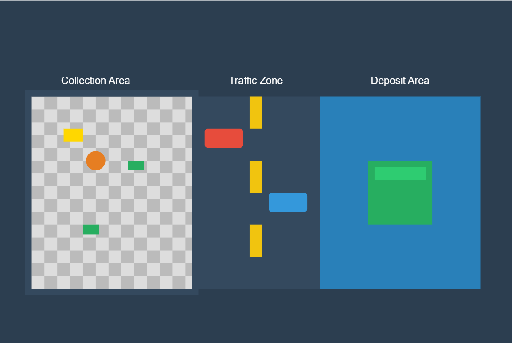

#  Game Ideas

## 1. Traffic Theft

### Game Overview
Traffic Theft is a fast-paced minigame from Pummel Party where players have 3 minutes to collect cash and gold bars from a building, cross a dangerous street with constant traffic, and deposit their loot in a scoring machine on the opposite side. Each cash pile is worth 1 point, and each gold bar is worth 2 points. The game's challenge comes from the movement penalty - the more items you carry, the slower you move, making it harder to dodge traffic. This balance of risk and reward, combined with ever-changing traffic conditions, makes it an engaging game that's easy to learn but rich in strategy.

## 2. Vector

### Game Overview
Vector is a side-scrolling parkour action game focused on fluid movement and escape sequences. Players control an employee fleeing from an evil corporation using an innovative three-button control system.

### Core Mechanics
#### Control System
1. **Up Button**
   - Jump
   - Wall run
   - Vaulting over obstacles
   - Grab ledges

2. **Down Button**
   - Slide under obstacles
   - Roll for momentum
   - Quick descent
   - Duck under hazards

3. **Right Button**
   - Sprint
   - Maintain momentum
   - Trigger special moves
   - Chain actions

#### Movement System
- Momentum-based parkour
- Fluid action transitions
- Chain moves for speed boosts
- Multiple path options

### Level Design
#### Environment Types
1. **Urban Rooftops**
   - Various height levels
   - Multiple path choices
   - Environmental hazards
   - Strategic shortcuts

2. **Interior Sections**
   - Tight corridors
   - Security systems
   - Alternative routes
   - Hidden passages

#### Progression System
- Gradually introducing new move combinations
- Increasing complexity of parkour sequences
- More challenging pursuit scenarios
- Expanding movement options

### Chase Mechanics
- Persistent pursuit by security forces
- Dynamic chase intensity
- Escape route decisions
- Consequence-based gameplay

### Design Goals
- Smooth, intuitive controls
- Satisfying movement flow
- Multiple solution paths
- Progressive skill development
- Engaging pursuit mechanics
